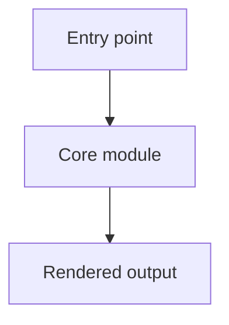

# Onboarding Template

Use this structure for the generated onboarding document. Remove sections that are truly not applicable.

````md
# <Repository Name> Onboarding

## Overview
Briefly explain what the project does and the main workflow it supports.

## Quick Start
List prerequisites, required environment variables, and the commands to install, run, lint, build, and test.

## Structure
Summarize the most important directories and modules a newcomer should understand first.

## Key Modules
List the main files or modules a newcomer should read first and explain why each matters.

## Beginner Starting Point
Name one beginner-friendly example and explain why it is a good starting point.

## Example Explanation
Explain the example step by step with file references.

## Learning Path
Explain what to read, run, or modify next after finishing the beginner example.

## Mermaid Diagram


## Gotchas
Call out risky assumptions, preview modes, external services, or documentation gaps.

## Evidence
- Files reviewed: `...`
- Commands used: `...`
- Inferences: `...` or `none`
````

## Notes

Always keep the required sections in the final Markdown document, even if some sections are brief.

Keep the document concise. Prefer a short explanation backed by specific evidence over a broad tour of every file.
