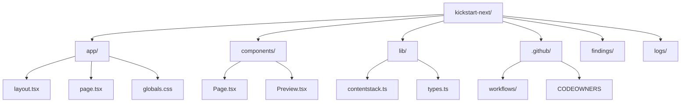

# Onboarding

## Overview
This repository is a minimal Next.js starter for Contentstack. Its main job is to fetch a `page` entry from Contentstack and render it as the homepage. It also supports Contentstack Live Preview and Visual Builder so content editors can make updates and see changes in real time.

At a high level, the app does three things:
- Configures a Contentstack client from environment variables
- Fetches homepage content by URL
- Renders that content either in normal mode or preview mode

This makes the repo a good example of a small content-driven Next.js app with a clear data flow.

## Folder Structure

- `app/`
  Next.js App Router files. This includes the root layout, homepage route, global styles, and favicon.
- `components/`
  React components for rendering content and handling preview mode.
- `lib/`
  Shared logic and TypeScript types. This is where the Contentstack integration lives.
- `.github/`
  Repository metadata and CI/workflow files.
- `findings/`
  Markdown notes and repository-analysis outputs.
- `logs/`
  Local log output.
- `.next/`
  Generated Next.js build artifacts.
- `node_modules/`
  Installed npm packages.

## Key Modules
### `lib/contentstack.ts`
This is the most important integration file in the repo.

It:
- Reads Contentstack-related environment variables
- Configures the Contentstack delivery SDK
- Enables preview mode
- Initializes Contentstack Live Preview
- Exposes `getPage(url)` to load a page entry by URL

If you want to understand how the app talks to Contentstack, start here.

### `app/page.tsx`
This is the homepage route.

It:
- Checks whether preview mode is enabled
- Renders `Preview` when live preview is active
- Otherwise fetches the homepage content and renders `Page`

This file is the top-level decision point for the app.

### `components/Preview.tsx`
This is the client-side live preview wrapper.

It:
- Initializes Contentstack Live Preview in the browser
- Fetches content for the current path
- Subscribes to entry changes
- Re-renders the page when content changes

This is the best file to read if you want to understand editor-facing preview behavior.

### `components/Page.tsx`
This is the shared renderer for page content.

It displays:
- Page title
- Description
- Hero image
- Rich text
- Modular content blocks

It also includes support for editable tags used by Contentstack Live Preview and sanitizes HTML before rendering it.

### `lib/types.ts`
This file defines the TypeScript model for the content returned from Contentstack.

The most important type is `Page`, which includes fields such as:
- `title`
- `description`
- `image`
- `rich_text`
- `blocks`

Use this file as the schema reference while reading the rest of the app.

## Example Explanation
The easiest way to understand the repository is to trace the homepage request:

1. A request reaches `app/page.tsx`.
2. The app checks `isPreview` from `lib/contentstack.ts`.
3. If preview mode is enabled, it renders `components/Preview.tsx`.
4. If preview mode is disabled, it calls `getPage("/")` from `lib/contentstack.ts`.
5. `getPage("/")` queries the Contentstack `page` content type for the entry whose `url` equals `/`.
6. The resulting entry is passed into `components/Page.tsx`.
7. `components/Page.tsx` renders the visible UI from the content fields.

That flow captures the whole application:
- `lib/` handles configuration and data access
- `app/` handles routing
- `components/` handles rendering

## Learning Path
For a new contributor, this is the best order to read the repository:

1. `README.md`
   Learn what the project is for, which credentials are needed, and how to run it locally.
2. `lib/contentstack.ts`
   Understand the Contentstack configuration, environment variables, and query logic.
3. `app/page.tsx`
   See the high-level route flow and the preview vs non-preview split.
4. `components/Page.tsx`
   Understand how content is translated into UI.
5. `lib/types.ts`
   Use the type definitions to understand the expected data model.
6. `components/Preview.tsx`
   Learn how live preview refreshes content on the client side.

## Where To Start
If you are brand new to this repository, start with the files that explain the app from the outside in.

The simplest starting sequence is:
1. Read `README.md` to understand the purpose of the repo and the required Contentstack setup.
2. Read `lib/contentstack.ts` to understand how the app connects to Contentstack and fetches content.
3. Read `app/page.tsx` to see the top-level request flow.
4. Read `components/Page.tsx` to see how the fetched content is rendered.

This order helps because it moves from setup, to data access, to route logic, to UI output.

## First Files To Read
- `README.md`
  Start here for project context, environment variables, and local setup steps.
- `lib/contentstack.ts`
  Read this next to understand the Contentstack SDK configuration, preview mode, and the `getPage("/")` query.
- `app/page.tsx`
  This is the shortest way to understand the runtime flow of the homepage.
- `components/Page.tsx`
  This shows exactly which content fields appear on the page and how they are rendered.
- `lib/types.ts`
  Use this as the content schema reference while reading the renderer.
- `components/Preview.tsx`
  Read this after the basics to understand how live preview updates the page in the browser.

## Suggested Exercises
- Run the app locally and identify where the homepage content is fetched.
  Goal: connect the `README.md` setup steps to the code in `lib/contentstack.ts` and `app/page.tsx`.
- Trace the homepage rendering flow from route to UI.
  Goal: follow the path from `app/page.tsx` to `getPage("/")` to `components/Page.tsx`.
- Add a temporary console log or breakpoint to inspect the fetched page data.
  Goal: compare the runtime data with the `Page` type in `lib/types.ts`.
- Change the styling of the title or description in `components/Page.tsx`.
  Goal: get comfortable making a safe UI-only change in a small file.
- Add support for rendering one additional field from the Contentstack `Page` model.
  Goal: practice updating types, fetching assumptions, and rendering logic together.
- Toggle preview mode using `NEXT_PUBLIC_CONTENTSTACK_PREVIEW` and observe the flow difference.
  Goal: understand when the app uses `Preview.tsx` instead of the normal server-rendered path.

## Notes For New Contributors
- The app depends on Contentstack credentials defined in `.env`.
- The homepage assumes there is a Contentstack `page` entry with the URL `/`.
- Preview behavior is controlled by `NEXT_PUBLIC_CONTENTSTACK_PREVIEW`.
- Remote image hosts are configured in `next.config.mjs`.

Once those pieces make sense, the entire repository becomes much easier to navigate.
